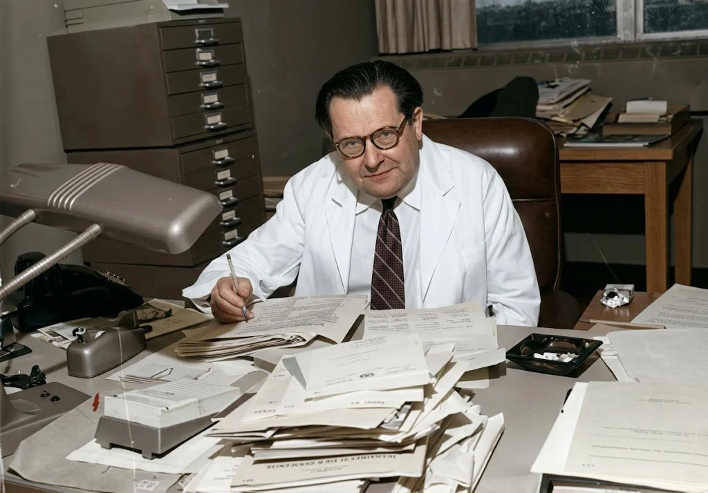

---
title: '¡Que se repita! una mirada sistémica a las juntas sociales'
description: 'Reflexiones sobre juntas significativas y su conexión con la teoría general de Sistemas'
pubDate: 'Jun 16 2026'
heroImage: '../../assets/magic.webp'
---

Reflexiones sobre juntas significativas y su conexión con la teoría general de Sistemas

por *Fabo*

---

Generalmente terminamos jugando Magic, una mesa llena de cartas, dados, un celular con el contador de vidas, tensión, comida y buena vida. A veces, su bebida, su cerveza, un humo cualquiera bajo comentarios sobre cartas, experiencias, bromas.

A primera vista pareciera que lo importante son las personas o las actividades, pero desde una mirada sistémica quizás vale la pena invertir la pregunta:

> ¿Y si lo importante fuera aquello que se repite?

A veces creemos que lo que mantiene unido a un grupo son las personas. Sin embargo, desde la teoría general de sistemas también podemos preguntarnos por aquello que persiste cuando las personas cambian.

Fuente: https://motamem.org/bertalanffy/

**Ludwig von Bertalanffy** proponía buscar *isomorfismos* en su Teoría General de Sistemas: patrones organizacionales que aparecen en sistemas distintos.

Desde esa perspectiva, jugar Magic, compartir una cerveza o reunirse a cocinar pueden parecer actividades diferentes.

Sin embargo, podrían cumplir **funciones relacionales** semejantes: convocar, generar interacción, reforzar vínculos y mantener la continuidad del grupo.

Formulemos la pregunta conectora:

> ¿Qué prácticas, rituales y conversaciones hacen posible que ese grupo siga existiendo?

- Porque las personas, sus motivaciones e intereses cambian.

- Los integrantes pueden estar, no estar presentes, estar y no estar presentes, no estar pero hablar de ellos.

La práctica recurrente y el deseo de sostenerla permiten que el sistema social conserve parte de su organización, incluso cuando cambian sus integrantes o la frecuencia de los encuentros.

Desde una mirada sistémica, lo relevante no es que las actividades permanezcan idénticas, sino que ciertas relaciones se preserven. En ese sentido, distintos rituales pueden ser isomorfos cuando cumplen una función organizacional semejante: reunir, vincular y dar continuidad al grupo a través del tiempo.

Pensandolo integradamente, quizás por eso algunas juntas siguen existiendo durante años, no porque sus integrantes sean siempre los mismos, ni porque las actividades permanezcan intactas. Persisten porque ciertas prácticas logran conservar una organización relacional que las personas continúan considerando significativa.

A veces cambian las cartas, las conversaciones, las bebidas o los horarios. Lo que permanece es el deseo compartido de volver a reunirse.

> Comcluyo que pertenecer a un grupo no consiste en ocupar siempre una silla, sino en seguir formando parte de aquello que se repite.